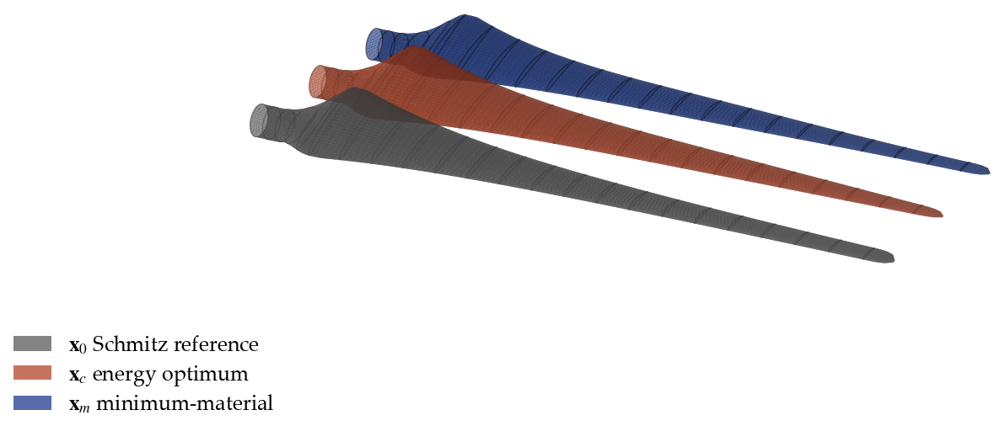
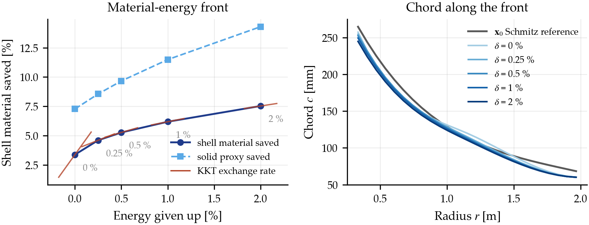

# Adjoint-based optimisation of a small wind turbine blade

This is my final-year Mechanical Engineering project (MCP820S) at the Namibia
University of Science and Technology, supervised by Prof. Hannes van der Walt.
The full title is *Gradient-Based Aerodynamic Optimisation of a Small Wind
Turbine Blade for Low-Wind-Speed Conditions Using a Discrete-Adjoint BEM
Framework*.

I wrote a blade-element momentum (BEM) solver in Python from scratch, derived
its discrete adjoint by hand, and used the exact gradients it gives to design a
lighter blade for a 2 m, three-bladed small wind turbine. The site is a
high-altitude ridge with low wind in the Khomas Hochland, west of Windhoek. The
mean wind speed at the 20 m hub is 6.5 m/s, and the air density is about 21 %
below its sea-level value.



## What the project found

I started out trying to maximise annual energy yield (AEP). The optimiser
converged cleanly but only found about +0.15 % over the classical Schmitz
blade, and it took me a while to work out why. With a fixed tip-speed-ratio
operating law and a rotor-speed ceiling, the Schmitz blade already gets within
0.15 % of the best energy any blade on this rotor can deliver.

So I turned the problem around: annual energy became a constraint, and the
optimiser minimises blade material instead.

```
minimise    shell material   ∫ c dr
subject to  AEP                 ≥ AEP of the Schmitz reference
            root bending moment ≤ reference     (KS aggregate over the load cases)
            root stress proxy   ≤ reference
            tip deflection      ≤ reference
            monotone chord and twist, 60 mm minimum tip chord,
            Reynolds numbers inside the validated polar range
```

At exactly the reference energy, the optimised blade uses 3.4 % less shell
material, about 1.62 kg per blade instead of 1.68 kg for a 2 mm glass/epoxy
skin. Loads, stress and deflection all stay at or below the reference. Giving
up 0.5 % of the energy raises the saving to 5.3 %. Ten different starting
points all converge to the same design.



## How it works

```
XFOIL polars → smooth (C¹) polar interpolant → BEM solver (Ning 2014 form)
  → AEP, loads and material functionals → discrete adjoint → SLSQP
```

The aerodynamic data are SG6043 airfoil polars from XFOIL over the Reynolds
range the blade sees, extended to ±180° with the Viterna method. I checked them
against UIUC wind-tunnel measurements and ran a sensitivity study on n_crit.

The BEM solver uses a single-residual formulation with Prandtl tip and hub loss
and a Glauert/Buhl correction for high induction. It brackets the root of the
residual, so it always converges.

I derived every partial derivative of the adjoint by hand
([`docs/adjoint_derivation.md`](docs/adjoint_derivation.md)) and checked each
one against the complex step. There are adjoints for energy, root bending
moment and tip deflection.

The blade shape is a B-spline chord and twist distribution with 5 + 5 control
points, and SciPy's SLSQP does the optimisation.

## Verification

I wanted every number in the project to be checkable.

On the NREL Phase VI rotor, my Cp-λ curve agrees with CCBlade to 0.51 % on
average, with pyBEMT to 1.8 % and with QBlade to within a few percent. All
three are BEM codes too, so this checks my implementation against theirs; none
of these comparisons is against measured data. The CCBlade and pyBEMT runs used
an earlier version of the S809 polar table, and I haven't repeated them since.
The details are in
[`docs/validation/bem-cross-validation.md`](docs/validation/bem-cross-validation.md).

The adjoint gradients agree with the complex step to about 1e-13, and with
finite differences down to the finite-difference noise floor. One variable is
off by a small amount. I traced that to round-off in the objective itself,
documented it, and kept the original tolerance.

An adjoint gradient costs about 1.1 objective evaluations however many design
variables there are, where finite differences cost 2n.

Over 3,000 objective evaluations, the energy function turned out smooth enough
to differentiate: it is C¹, with one curvature break at the Buhl threshold.

Each folder under [`verification/`](verification/) has a README saying what
was run, what came out, how to reproduce it and what would prove it wrong.
[`verification/README.md`](verification/README.md) gives the order to re-run
them in.

## Repository layout

```
src/
  bem/           BEM solver: station residual, corrections, rotor, power curves
  polars/        polar cache loading, C¹ interpolant, Viterna extension
  xfoil/         XFOIL wrapper and polar cache generation
  design/        B-spline parameterisation, bounds, Schmitz reference blade
  objective/     wind resource (Weibull), AEP, loads, material proxies
  adjoint/       discrete adjoint systems (energy, root moment, deflection)
  gradients/     finite-difference and adjoint gradients, the optimisation problem
  validation/    cross-checks against CCBlade, pyBEMT, QBlade and UIUC data
  config/        typed loader for config/
config/          site, rotor and polar-cache configuration (YAML)
data/            airfoil coordinates, polar caches, reference data
docs/            design basis, assumptions, adjoint derivation, validation write-up
tests/           pytest suite, including a golden-file regression
verification/    scripts, results (JSON) and figures behind every reported number
```

SG6043 is the design airfoil. S809 is only there to validate the solver on the
NREL Phase VI rotor, which other people have also computed.

A few rules I kept throughout the code:

- Physical inputs have no hidden defaults. Air density and viscosity are
  required arguments, and a config value that hasn't been decided yet raises an
  error instead of falling back to a guess.
- The polar data raise an error for an angle of attack or Reynolds number
  outside their range. Clamping to the edge of the table would change Cp by as
  much as 60 % with no warning.
- `src/bem` never imports XFOIL. A test checks this, so the solver runs from
  the committed polar cache alone.

## Running it

You need Python 3.12 or newer.

```bash
python -m pip install -r requirements.txt
```

Run the tests from the repository root:

```bash
pytest
```

Five tests are marked `xfail` because the polar-cache sanity checks don't fit a
thin, high-camber airfoil at low Reynolds number; the reasoning is in
[`data/polars/sg6043/README.md`](data/polars/sg6043/README.md). One test fails
on purpose. It is the gradient case from the verification section, and I left
it failing so that any change to it shows up.

To reproduce the main result:

```bash
python verification/mass_optimisation/run_mass_slsqp.py --delta 0     # ~20 s
python verification/mass_optimisation/run_multistart.py               # ~3 min
python verification/mass_optimisation/run_sweep.py                    # ~4 min
```

To use the solver directly (run from `src/`):

```python
from config import load_phase_vi_rotor
from bem.rotor import phase_vi_geometry, PHASE_VI_RATED_RPM
from bem.powercurve import power_curve

rotor = load_phase_vi_rotor()
air = dict(air_density=rotor.air_density,
           kinematic_viscosity=rotor.kinematic_viscosity)

curve = power_curve(phase_vi_geometry(), [5, 7, 10, 13, 15],
                    rpm=PHASE_VI_RATED_RPM, **air)
for p in curve["points"]:
    print(f"V={p['v_inf']:5.1f} m/s  Cp={p['Cp']:.4f}  P={p['power']:8.1f} W")
```

XFOIL, CCBlade, pyBEMT and QBlade are only needed to regenerate the polar cache
or re-run the cross-validation. The caches are committed, so you can run the
solver and the optimisation without any of them.

## Further reading

- [`docs/DESIGN-BASIS.md`](docs/DESIGN-BASIS.md): the site, machine and model,
  why the objective is material rather than energy, and the results with a
  source for every number
- [`docs/OUTSTANDING-INPUTS.md`](docs/OUTSTANDING-INPUTS.md): each modelling
  assumption, the real data that would replace it, and what would need
  re-running; also the laminate behind the kilogram and stress figures
- [`docs/adjoint_derivation.md`](docs/adjoint_derivation.md): the full adjoint
  derivation

## Author

Mias J. Hendrikse, Mechanical Engineering, NUST (2026)
