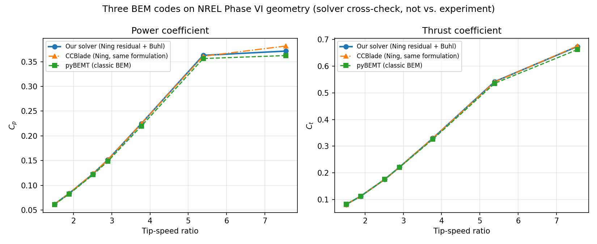

# Stage 6: cross-validation against pyBEMT and CCBlade (not against experiment)

**What this is:** a comparison of three independent BEM implementations —
this project's Stages 1-4 solver, [pyBEMT](https://github.com/kegiljarhus/pyBEMT)
(MIT licensed), and [CCBlade](https://github.com/WISDEM/CCBlade) (part of
NREL's WISDEM stack, Apache-2.0 licensed) — run on the same rotor geometry
with, as far as practically achievable, the same input polar data.

**What this is *not*:** validation against NREL Phase VI's real
wind-tunnel measurements. That data could not be sourced this project (see
the 2026-07-25 journal entry, "Stage 5 (attempted, stopped)") — every
avenue tried hit a paywall, a bot-detection block, or a report that turned
out not to contain the summarized performance curve. Agreement between the
solvers below says "three different pieces of BEM code, with different
corrections and root-finding strategies, land in the same neighbourhood on
the same geometry" — it is *not* evidence that any of them match the real
rotor.

**Why CCBlade specifically matters here, beyond "a second cross-check":**
CCBlade is the reference implementation of S. Andrew Ning's BEM formulation
(Ning 2014) — the *same underlying method* this project's solver
implements, unlike pyBEMT's more classic BEM. Closer agreement with
CCBlade than with pyBEMT is therefore a meaningful, expected result if the
Ning-formulation reasoning behind this project's solver is sound, not
just "a third data point." **That is what was found** — see Results below.

## Geometry and inputs

All three solvers were given the real NREL Phase VI blade geometry (Table
A-1, Hand et al. 2001, NREL/TP-500-29955 — see `bem.rotor.phase_vi_geometry`
and `PHASE_VI_TABLE_A1_STATIONS`), Sequence S configuration: 2 blades,
R=5.029 m, hub at 0.508 m, 71.63 RPM, 3° collective pitch. The root's
cylindrical/transition stations (r < 1.2575 m) are excluded from all three
solvers — no published 2D polar exists for that non-airfoil section, and it
contributes negligible torque at its small radius (same simplification
used for the demo geometry in Stage 4).

All three solvers were also given the **exact same discretized airfoil
table**: the real S809 XFOIL polar cache (`data/polars/s809/`, from
Phase 0), resampled onto a shared 0.5° grid, flat-extrapolated outside the
XFOIL-converged [-8°, 18°] range out to ±180° (both external codes need
full-circle coverage; neither solver's converged solution ever lands out
there for these operating points — see `compare_pybemt.py`'s module
docstring). Per-station Reynolds number was estimated once (a fixed 7 m/s
zero-induction reference, not re-estimated per sweep point) and rounded to
the nearest of the six cached buckets (100k-500k) — every station on this
rotor rounded to the 500k bucket, since Phase VI's actual chord-based
Reynolds numbers (roughly 570k-940k at rated RPM) run higher than our
existing S809 cache's upper bound. **This is a real, worth-flagging
limitation of reusing the Phase 0 cache here** — it was built for an
earlier, smaller synthetic project rotor, not sized for Phase VI — but it
affects all three solvers identically, so it does not bias the cross-solver
comparison; it does mean the *absolute* Cp/Ct numbers below should not be
over-interpreted, only the relative agreement between the codes.

The only remaining input-side difference is interpolation method between
table points: linear (our side, `numpy.interp`), quadratic
(pyBEMT's `scipy.interpolate.interp1d`), and a smoothed bivariate spline
(CCBlade's `RectBivariateSpline`, s=0.01 for Cl). Checked directly (see
the Stage 6 journal entry): CCBlade's smoothing shifts Cl by at most
~0.01 at a table resolution of 0.5°, not enough on its own to explain any
of the deviations reported below.

## What differs between the solvers (by design, not by input data)

| | This project (Stages 1-4) | pyBEMT | CCBlade |
|---|---|---|---|
| Underlying formulation | Ning (2014) single-variable phi residual | Independently-derived, equivalent-structure phi residual | **Ning (2014) -- same method, reference implementation** |
| Root-finding | `scipy.optimize.brentq` over a **scanned, pole-avoiding bracket** (`station._select_bracket`) | `scipy.optimize.bisect` over a **fixed** `(0.01*pi, 0.9*pi)` bracket, falling back to a crude 3600-point brute-force scan if bisection fails | Ning's own guaranteed-convergence bracketed solve |
| Tip-loss | Prandtl, `F_tip = (2/pi) acos(exp(-f))`, `f = (B/2)(R-r)/(r sin phi)` | Identical formula | Identical formula |
| Hub-loss | Prandtl, `f = (B/2)(r-r_hub)/(r_hub sin phi)` (denominator: **hub radius**) | Prandtl, `f = (B/2)(r-r_hub)/(r sin phi)` (denominator: **station radius**) -- documented alternative convention, not a bug | Prandtl (same family as ours) |
| High-thrust (turbulent wake) correction | Buhl (2005) closed-form quadratic, active for a > 0.4 | **None** -- plain momentum `Ct=4aF(1-a)` at all induction levels | Glauert-style correction (CCBlade's own implementation) |

## Results



Full swept-point table (wind speeds match NREL's own Sequence S test
points, fixed RPM=71.63, so this sweep is directly comparable in shape to
a real Sequence S run once experimental data becomes available):

| Wind speed (m/s) | TSR | Cp (ours) | Cp (pyBEMT) | Cp (CCBlade) | Ct (ours) | Ct (pyBEMT) | Ct (CCBlade) |
|---:|---:|---:|---:|---:|---:|---:|---:|
| 5.0 | 7.545 | 0.3714 | 0.3623 | 0.3815 | 0.6739 | 0.6620 | 0.6755 |
| 7.0 | 5.389 | 0.3627 | 0.3563 | 0.3610 | 0.5422 | 0.5358 | 0.5409 |
| 10.0 | 3.772 | 0.2246 | 0.2196 | 0.2247 | 0.3298 | 0.3261 | 0.3300 |
| 13.0 | 2.902 | 0.1519 | 0.1489 | 0.1519 | 0.2213 | 0.2208 | 0.2211 |
| 15.0 | 2.515 | 0.1234 | 0.1216 | 0.1238 | 0.1756 | 0.1757 | 0.1755 |
| 20.0 | 1.886 | 0.0835 | 0.0823 | 0.0835 | 0.1122 | 0.1127 | 0.1122 |
| 25.0 | 1.509 | 0.0620 | 0.0612 | 0.0620 | 0.0814 | 0.0819 | 0.0814 |

Deviation at peak Cp (within this sweep) and two off-design points:

| Wind speed (m/s) | TSR | Cp (ours) | Cp dev. vs pyBEMT | Cp dev. vs CCBlade | Ct (ours) | Ct dev. vs pyBEMT | Ct dev. vs CCBlade |
|---:|---:|---:|---:|---:|---:|---:|---:|
| 5.0 (peak $C_p$ in this sweep) | 7.545 | 0.3714 | +0.0090 (+2.5%) | -0.0102 (-2.7%) | 0.6739 | +0.0119 (+1.8%) | -0.0016 (-0.2%) |
| 10.0 | 3.772 | 0.2246 | +0.0050 (+2.3%) | -0.0001 (-0.0%) | 0.3298 | +0.0037 (+1.1%) | -0.0002 (-0.1%) |
| 25.0 | 1.509 | 0.0620 | +0.0008 (+1.3%) | +0.0000 (+0.0%) | 0.0814 | -0.0005 (-0.6%) | -0.0000 (-0.0%) |

**Mean |Cp deviation| across the full 7-point sweep: 1.83% vs pyBEMT,
0.51% vs CCBlade.** ("Peak" above means peak within this 7-point sweep,
not a resolved continuous peak — the sweep wasn't dense enough to pin
that down exactly, and doing so wasn't the point of this exercise.)

**This is the meaningful result flagged in the introduction: our solver
agrees with CCBlade (same underlying Ning formulation) roughly 3.5x more
closely, on average, than it does with pyBEMT (classic BEM).** At 5 of the
7 swept points, agreement with CCBlade is within 0.1% -- essentially the
same numbers via two independently-written codebases implementing the
same method. The one point where CCBlade diverges more than pyBEMT
(v_inf=5 m/s, the highest-TSR / most heavily-loaded point sampled) is
explained below, and is itself informative rather than a wrinkle to
smooth over.

## Explaining the divergence (not reconciling it)

### vs. pyBEMT

1. **Hub-loss convention (inboard stations).** At r=1.26-2.5 m (v_inf=5
   m/s), `F` differs noticeably between the two codes (e.g. F=0.98 ours vs.
   F=0.84 pyBEMT at r=1.26 m) purely from the denominator choice in the
   hub-loss formula (table above) — a genuine, literature-documented
   implementation variation between BEM codes, not an error in either.

2. **Root-finding robustness at the most heavily-loaded station.** At
   r=5.0 m, v_inf=5 m/s (the highest-TSR point in the sweep), our solver
   converges cleanly to a=0.59 (correctly engaging the Buhl correction,
   physically bounded). pyBEMT's plain `bisect` fails outright at this
   station (`f(a) and f(b) must have different signs` — it hits the same
   class of residual pole documented in this project's own Stage 1/3
   journal entries) and falls back to its 3600-point brute-force scan,
   which returns a **non-physical** a=-1.1 at that one station. A generic
   bracket with no pole-avoidance and a crude fallback is more fragile at
   high thrust loading than a bracket-scanning, pole-aware root-find --
   exactly the robustness difference the task brief anticipated. It is a
   solver-robustness difference, not a modelling disagreement.

3. **No high-thrust correction in pyBEMT at all.** Confirmed by reading
   `pybemt/rotor.py` directly — wherever a station's induction exceeds
   0.4, our solver and pyBEMT are, by construction, evaluating different
   physics for that station (Buhl's corrected Ct(a) vs. plain momentum
   theory's rolled-over Ct(a)).

### vs. CCBlade

Per-station diagnostics (`a`, `alpha`, `Cl` at every station, v_inf=7 m/s)
show our solver and CCBlade agreeing to the 3rd-4th decimal place almost
everywhere -- consistent with sharing the same underlying formulation.
The one point of real disagreement, v_inf=5 m/s (Cp: 0.3714 ours vs. 0.3815
CCBlade, -2.7%), sits at the same highest-TSR condition that also gave
pyBEMT its worst-agreement point, and for a related reason: this is simply
the most heavily-loaded, hardest-to-solve condition sampled for any of the
three codes -- not evidence of a specific CCBlade/ours methodological gap
the way the hub-loss-formula or missing-correction findings above are.

**A second fairness issue was found and fixed for the CCBlade comparison,
analogous to the pyBEMT `dr` fix**: CCBlade's own `evaluate()` integrates
loads out to the *physical* Rhub/Rtip boundaries (effectively assuming the
load tapers to zero there), not just between the first and last given
station. Since our stations start at r=1.2575 m while the real hub is at
r=0.508 m (the root/transition region is deliberately unmodeled -- no S809
polar applies there), this let CCBlade silently integrate over a wider
span than our solver or pyBEMT do, inflating its Cp/Ct by ~4-5% for a
reason that had nothing to do with solver physics. Confirmed by comparing
per-station `a`/`alpha`/`Cl` (which matched closely) against the
integrated totals (which didn't at first), then by re-running with `Rhub`
pulled in to just under the first station, which closed most of the gap.
Rather than move `Rhub` itself (also, correctly, an input to the Prandtl
hub-loss factor -- moving it would change the physics, not just the
integration domain), `compare_ccblade.py` uses CCBlade's
`distributedAeroLoads()` for per-station Np/Tp and integrates them with
the exact same trapezoidal rule as `bem.rotor._trapz`, over exactly the
same station range used everywhere else in this comparison. The numbers
above are all with that fix applied.

None of the divergences above were reconciled by adjusting either
solver's physics constants. The two fixes that *were* applied (pyBEMT's
`dr`, CCBlade's integration domain) corrected genuine setup/fairness bugs
-- making sure every solver answers the same question over the same
domain -- not physics or tuning changes, and both were necessary before
any of these comparisons were meaningful.

## How to reproduce

Three scripts, run in order, each needing its own environment (see
`compare_pybemt.py`'s module docstring for why they're split):

1. `compare_pybemt.py` -- pyBEMT's virtualenv -- writes
   `docs/validation/pybemt_case/results.json`
2. `compare_ccblade.py` -- CCBlade's virtualenv -- writes
   `docs/validation/ccblade_case/results.json`
3. `plot_bem_comparison.py` -- plain repo python (only needs numpy +
   matplotlib, already used elsewhere in this repo) -- reads both JSON
   files, writes `docs/validation/bem_cross_validation_comparison.png`,
   prints the markdown tables above

### 1. pyBEMT

Clone and install **outside this repository**:

```
cd <parent directory of this repo>   # a sibling, not inside it
git clone https://github.com/kegiljarhus/pyBEMT.git pybemt-reference
cd pybemt-reference
python -m venv .venv
.venv/Scripts/pip install numpy scipy matplotlib pandas
```

pyBEMT (last released years ago) uses `configparser.SafeConfigParser`,
removed from the Python standard library in 3.12. If running Python 3.12+,
patch the external clone in place (this patch is **not** carried in this
repo — it only touches the sibling clone):

```
sed -i 's/from configparser import SafeConfigParser/from configparser import ConfigParser/; \
        s/cfg = SafeConfigParser()/cfg = ConfigParser()/' pybemt/solver.py
```

Then install it (editable, so the patch above takes effect):

```
.venv/Scripts/pip install -e .
```

Run (from this repo's `src/`):

```
cd src
"../../pybemt-reference/.venv/Scripts/python.exe" -m bem.compare_pybemt
```

If the clone lives somewhere other than the default sibling location, set
`PYBEMT_REFERENCE_PATH` first. This also (re)writes
`docs/validation/pybemt_case/phase_vi.ini` (the pyBEMT config -- safe to
inspect, do not hand-edit, it's overwritten every run) and per-Reynolds-
bucket AeroDyn `.dat` airfoil tables into the **external** clone's
`pybemt/airfoils/` directory (not this repo).

### 2. CCBlade

CCBlade ships as part of NREL's WISDEM package and needs a compiled
Fortran extension (`wisdem.ccblade._bem`). **A prebuilt wheel exists on
PyPI for common platforms** (confirmed here on Windows/CPython 3.12), so
in that case no local Fortran/meson/ninja toolchain is needed at all:

```
cd <parent directory of this repo>   # a sibling, not inside it
mkdir ccblade-reference
python -m venv ccblade-reference/.venv
ccblade-reference/.venv/Scripts/pip install wisdem numpy scipy matplotlib pandas
```

**If no prebuilt wheel is available for your platform**, pip will attempt
to build WISDEM from source, which *does* need a Fortran compiler,
[meson](https://mesonbuild.com/), and [ninja](https://ninja-build.org/) on
`PATH` -- install those first (e.g. via your OS package manager, or
`pip install meson ninja` plus a system Fortran compiler such as
`gfortran`), or build CCBlade standalone from
https://github.com/WISDEM/CCBlade's own instructions instead of the
WISDEM wheel. This project's environment had none of gfortran/meson/ninja
installed, but did not need them -- the PyPI wheel resolved directly.

Run (from this repo's `src/`):

```
cd src
"../../ccblade-reference/.venv/Scripts/python.exe" -m bem.compare_ccblade
```

If the environment lives somewhere other than the default sibling
location, set `CCBLADE_REFERENCE_PATH` first.

### 3. Combine and plot

```
cd src
python -m bem.plot_bem_comparison
```

Uses this repo's normal Python environment (matplotlib/numpy, already a
dependency elsewhere).

## What's still missing

The actual NREL Phase VI experimental Cp-lambda curve. Once it's sourced
(see the Stage 5 journal entry for what was tried), it should be added as
a fourth series on the same plot, and this document's framing updated from
"solver cross-check" to a real validation writeup.
