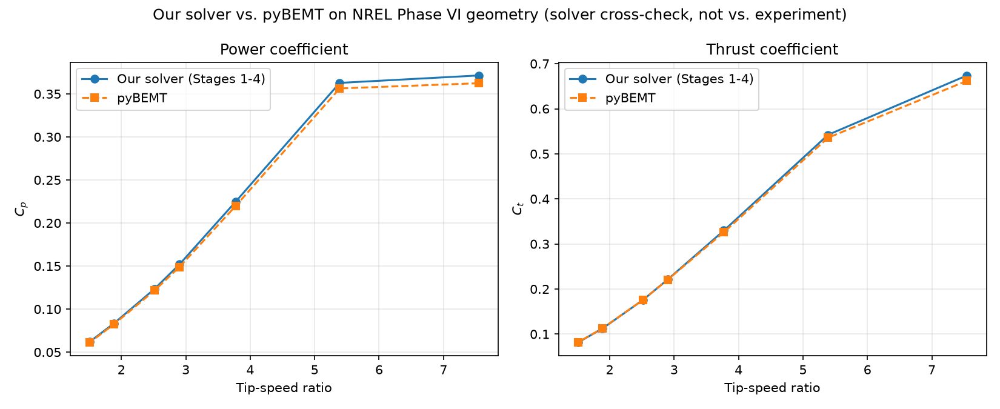

# Stage 6: cross-check against pyBEMT (not a validation against experiment)

**What this is:** a comparison of two independent BEM implementations
(this project's Stages 1-4 solver, and [pyBEMT](https://github.com/kegiljarhus/pyBEMT),
MIT licensed) run on the same rotor geometry with the same input polar
data.

**What this is *not*:** validation against NREL Phase VI's real
wind-tunnel measurements. That data could not be sourced this project (see
the 2026-07-25 journal entry, "Stage 5 (attempted, stopped)") — every
avenue tried hit a paywall, a bot-detection block, or a report that turned
out not to contain the summarized performance curve. Agreement between the
two solvers below says "two different pieces of BEM code, with different
corrections and root-finding strategies, land in the same neighbourhood on
the same geometry" — it is *not* evidence that either one matches the real
rotor.

## Geometry and inputs

Both solvers were given the real NREL Phase VI blade geometry (Table A-1,
Hand et al. 2001, NREL/TP-500-29955 — see `bem.rotor.phase_vi_geometry` and
`PHASE_VI_TABLE_A1_STATIONS`), Sequence S configuration: 2 blades, R=5.029 m,
hub at 0.508 m, 71.63 RPM, 3° collective pitch. The root's cylindrical/
transition stations (r < 1.2575 m) are excluded from both solvers — no
published 2D polar exists for that non-airfoil section, and it contributes
negligible torque at its small radius (same simplification used for the
demo geometry in Stage 4).

Both solvers were also given the **exact same discretized airfoil table**:
the real S809 XFOIL polar cache (`data/polars/s809/`, from Phase 0),
resampled onto a shared 0.5° grid, flat-extrapolated outside the
XFOIL-converged [-8°, 18°] range out to ±180° (an AeroDyn-format table needs
full-circle coverage; neither solver's converged solution ever lands out
there for these operating points — see `compare_pybemt.py`'s module
docstring). Per-station Reynolds number was estimated once (a fixed 7 m/s
zero-induction reference, not re-estimated per sweep point) and rounded to
the nearest of the six cached buckets (100k-500k) — every station in this
particular rotor rounded to the 500k bucket, since Phase VI's actual
chord-based Reynolds numbers (roughly 570k-940k at this rated RPM) run
higher than our existing S809 cache's upper bound. **This is a real, worth-
flagging limitation of reusing the Phase 0 cache here** — it was built for
an earlier, smaller synthetic project rotor, not sized for Phase VI — but
it affects both solvers identically, so it does not bias the cross-solver
comparison; it does mean the *absolute* Cp/Ct numbers below should not be
over-interpreted, only the relative agreement between the two codes.

The only remaining difference in how the two solvers see this table is
interpolation method: linear (our side, `numpy.interp`) vs. quadratic
(pyBEMT's own `scipy.interpolate.interp1d(kind='quadratic')`). At a 0.5°
grid resolution this is judged negligible.

## What differs between the two solvers (by design, not by input data)

| | This project (Stages 1-4) | pyBEMT |
|---|---|---|
| Residual formulation | Ning (2014) single-variable phi residual | Equivalent single-variable phi residual (independently derived, same structure) |
| Root-finding | `scipy.optimize.brentq` over a **scanned, pole-avoiding bracket** (`station._select_bracket`) | `scipy.optimize.bisect` over a **fixed** `(0.01*pi, 0.9*pi)` bracket, falling back to a crude 3600-point brute-force scan if bisection fails |
| Tip-loss | Prandtl, `F_tip = (2/pi) acos(exp(-f))`, `f = (B/2)(R-r)/(r sin phi)` | Identical formula |
| Hub-loss | Prandtl, `f = (B/2)(r-r_hub)/(r_hub sin phi)` (denominator: **hub radius**) | Prandtl, `f = (B/2)(r-r_hub)/(r sin phi)` (denominator: **station radius**) — a documented alternative convention, not a bug in either code |
| High-thrust (turbulent wake) correction | Buhl (2005) closed-form quadratic, active for a > 0.4 | **None** — plain momentum `Ct=4aF(1-a)` used at all induction levels |

## Results



Full swept-point table (wind speeds match NREL's own Sequence S test
points, fixed RPM=71.63, so this sweep is directly comparable in shape to
a real Sequence S run once experimental data becomes available):

| Wind speed (m/s) | TSR | Cp (ours) | Cp (pyBEMT) | Ct (ours) | Ct (pyBEMT) |
|---:|---:|---:|---:|---:|---:|
| 5.0 | 7.545 | 0.3714 | 0.3623 | 0.6739 | 0.6620 |
| 7.0 | 5.389 | 0.3627 | 0.3563 | 0.5422 | 0.5358 |
| 10.0 | 3.772 | 0.2246 | 0.2196 | 0.3298 | 0.3261 |
| 13.0 | 2.902 | 0.1519 | 0.1489 | 0.2213 | 0.2208 |
| 15.0 | 2.515 | 0.1234 | 0.1216 | 0.1756 | 0.1757 |
| 20.0 | 1.886 | 0.0835 | 0.0823 | 0.1122 | 0.1127 |
| 25.0 | 1.509 | 0.0620 | 0.0612 | 0.0814 | 0.0819 |

Deviation at peak Cp (within this sweep) and two off-design points:

| Wind speed (m/s) | TSR | Cp (ours) | Cp (pyBEMT) | Cp deviation | Ct (ours) | Ct (pyBEMT) | Ct deviation |
|---:|---:|---:|---:|---:|---:|---:|---:|
| 5.0 (peak $C_p$ in this sweep) | 7.545 | 0.3714 | 0.3623 | +0.0090 (+2.5%) | 0.6739 | 0.6620 | +0.0119 (+1.8%) |
| 10.0 | 3.772 | 0.2246 | 0.2196 | +0.0050 (+2.3%) | 0.3298 | 0.3261 | +0.0037 (+1.1%) |
| 25.0 | 1.509 | 0.0620 | 0.0612 | +0.0008 (+1.3%) | 0.0814 | 0.0819 | -0.0005 (-0.6%) |

("Peak" here means peak within this 7-point sweep, not a resolved
continuous peak — the sweep wasn't dense enough to pin that down exactly,
and doing so wasn't the point of this exercise.)

## Explaining the divergence (not reconciling it)

Overall integrated Cp/Ct agree to within **1-3%** across the whole swept
range — closer than the correction differences above alone would suggest,
because the stations where those corrections matter most (near-root, and
the tip once a > 0.4) carry a small fraction of the rotor's total torque
and thrust. Per-station diagnostics explain where the small residual
differences actually come from:

1. **Hub-loss convention (inboard stations).** At r=1.26-2.5 m (v_inf=5
   m/s), `F` differs noticeably between the two codes (e.g. F=0.98 ours vs.
   F=0.84 pyBEMT at r=1.26 m) purely from the denominator choice in the
   hub-loss formula (table above) — a genuine, literature-documented
   implementation variation between BEM codes, not an error in either.
   Local induction `a` differs by a few percent at these stations as a
   direct consequence.

2. **Root-finding robustness at the most heavily-loaded station.** At the
   single most extreme point sampled (r=5.0 m, v_inf=5 m/s, the highest-TSR
   point in the sweep), our solver converges cleanly to a=0.59 (correctly
   engaging the Buhl correction, physically bounded). pyBEMT's plain
   `bisect` fails outright at this station (`f(a) and f(b) must have
   different signs` — it hits the same class of residual pole documented
   in this project's own Stage 1/3 journal entries) and falls back to its
   3600-point brute-force scan, which returns a **non-physical** a=-1.1 at
   that one station. This is exactly the robustness difference the task
   brief anticipated: a generic bracket with no pole-avoidance and a crude
   fallback is more fragile at high thrust loading than a bracket-scanning,
   pole-aware root-find. It is a solver-robustness difference, not a
   modelling disagreement, and it is not "fixed" here in either codebase.

3. **No high-thrust correction in pyBEMT at all.** Confirmed by reading
   `pybemt/rotor.py` directly (see table above) — wherever a station's
   induction exceeds 0.4, our solver and pyBEMT are, by construction,
   evaluating different physics for that station (Buhl's corrected Ct(a)
   vs. plain momentum theory's rolled-over Ct(a)). This is expected and is
   the main reason the two curves are not identical, not a bug to chase.

None of the above was adjusted to force closer agreement — the fix that
was applied (see "How to reproduce", `dr` note) corrected a genuine
integration-setup bug (uniform-spacing default silently misapplied to
Phase VI's non-uniform real station table), not a physics or tuning
change, and was necessary before *any* comparison here was meaningful.

## How to reproduce

### 1. Clone and install pyBEMT externally (never inside this repo)

```
cd <parent directory of this repo>   # a sibling, not inside it
git clone https://github.com/kegiljarhus/pyBEMT.git pybemt-reference
cd pybemt-reference
python -m venv .venv
.venv/Scripts/pip install numpy scipy matplotlib pandas
```

pyBEMT (last released years ago) uses `configparser.SafeConfigParser`,
removed from the Python standard library in 3.12. If running Python 3.12+,
patch the external clone in place (this patch is **not** carried in this
repo — it only touches the sibling clone):

```
sed -i 's/from configparser import SafeConfigParser/from configparser import ConfigParser/; \
        s/cfg = SafeConfigParser()/cfg = ConfigParser()/' pybemt/solver.py
```

Then install it (editable, so the patch above takes effect):

```
.venv/Scripts/pip install -e .
```

### 2. Run the comparison

From this repo's `src/` directory, using **pyBEMT's own virtualenv
python** (it has pybemt, numpy, scipy, pandas, and matplotlib; this
repo's `bem`/`xfoil` packages only need numpy/scipy, already present):

```
cd src
"../../pybemt-reference/.venv/Scripts/python.exe" -m bem.compare_pybemt
```

If the pyBEMT clone lives somewhere other than the default sibling
location, set `PYBEMT_REFERENCE_PATH` first.

This regenerates, every run:
- `docs/validation/pybemt_case/phase_vi.ini` (the pyBEMT config — safe to
  inspect, do not hand-edit, it's overwritten each run)
- Per-Reynolds-bucket AeroDyn `.dat` airfoil tables, written into the
  **external** clone's `pybemt/airfoils/` directory (not this repo)
- `docs/validation/pybemt_cp_lambda_comparison.png` (the plot above)
- The full-sweep and deviation markdown tables (printed to stdout — this
  document's tables were pasted in from that output)

## What's still missing

The actual NREL Phase VI experimental Cp-lambda curve. Once it's sourced
(see the Stage 5 journal entry for what was tried), it should be added as
a third series on the same plot, and this document's framing updated from
"solver cross-check" to a real validation writeup.
